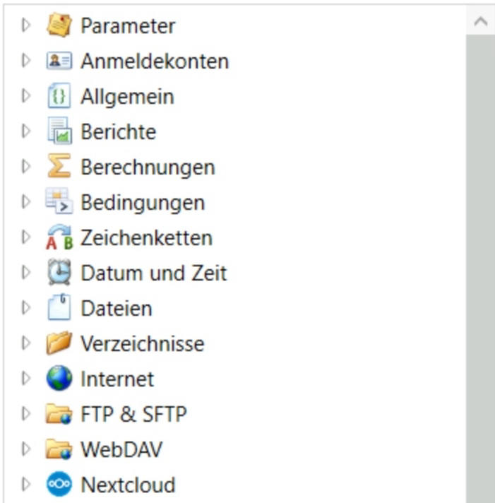
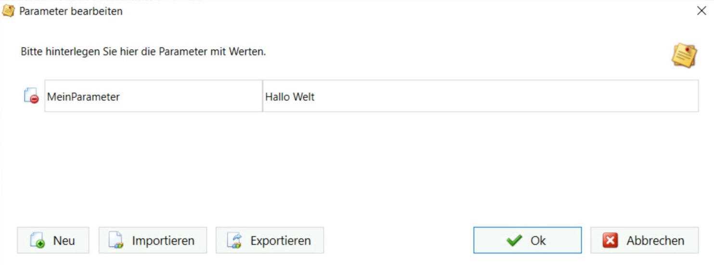
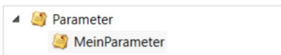

# Aktionen und Parameter
Aktionen & Parameter
--------------------

Die Aktionen und Parameter werden durch einen Doppelklick in den Skripteditor übernommen. 

Detaillierte Informationen zu den Aktionen finden Sie unter den Seiten der [Aktionen](https://docs.logisoft.de/share/Djb6HWIpIhVG)



Parameter verwalten
-------------------

Parameter können im Hauptmenü über "Parameter bearbeiten" angelegt, gelöscht und geändert werden. 



Über die Schaltfläche **Neu** können neue Parameter hinzugefügt werden. Dabei hält das erste Eingabefeld von links die Bezeichnung des Parameters und das zweite Eingabefeld hält den Wert des Parameters. 

Wird ein neuer Parameter hinzugefügt, wird dieser Parameter in dem rechten Menü "Aktionen und Parameter" angezeigt.



Die dort aufgeführten Parameter können durch einen Doppelklick auf den Parameter in das Skript übernommen werden. 

Im Skript werden diese dann in der gleichen Schreibweise wie Variablen angezeigt:

```text-x-trilium-auto
{@MeinParameter}
```

Zur Laufzeit werden die Parameter dann mit den zugewiesenen Werten ersetzt.

Besonderheiten der Parameter
----------------------------

Parameter können in allen Skripten der jeweiligen Batchpad Installation wiederverwendet werden.

Parameter können zudem für andere Batchpad Installationen in eine Datei exportiert und dann dort wieder importiert werden.

Die Werte der Parameter werden nicht in dem gespeicherten Skript gespeichert. Sensible Informationen wie z.B. Passwörter werden so nicht mit in das Skript übernommen.