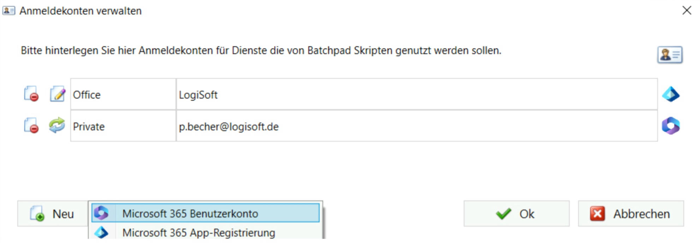
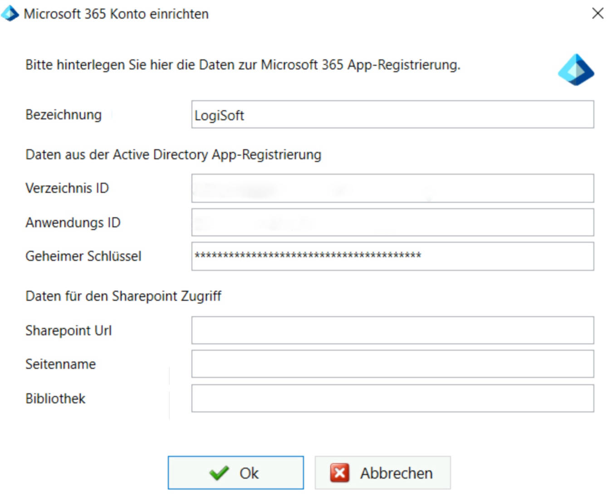
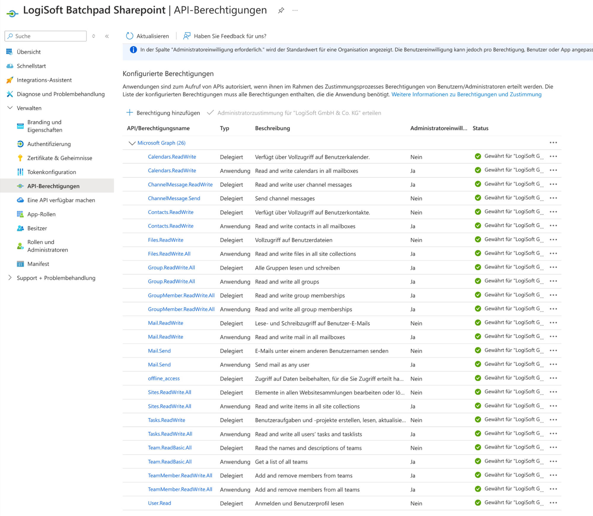
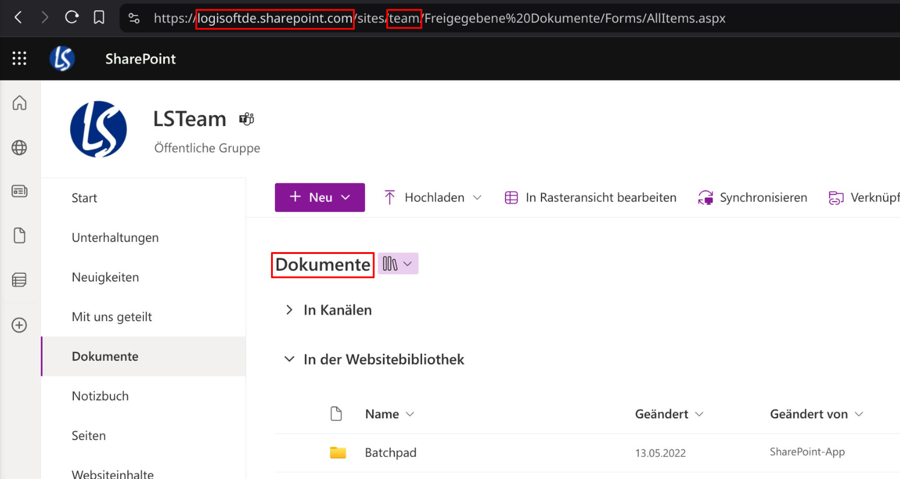

# Anmeldekonten verwalten
Microsoft 365 Konto einbinden
-----------------------------

Über die Anmeldekonten können Microsoft 365 Konten zur Ausführung von Aktionen für OneDrive, Sharepoint, Outlook (E-Mail), Kontakte, Aufgaben (ToDo's), Kalender und Teams in den Skripten eingebunden werden. 

Hierzu können je nach Anwendungsfall sowohl ein normales Benutzerkonto als auch eine Entra App-Registrierung eingebunden werden.

Die Anmeldekonten erscheinen nach der Anlage in dem rechten Baum "Aktionen & Parameter" und können von dort aus in das Skript eingebunden werden.

Microsoft 365 App-Registrierung
-------------------------------

Um eine Microsoft 365 App-Registrierung zu erstellen, rufen Sie bitte im Azure Portal unter Microsoft Entra Id die App-Registrierungen auf: [https://portal.azure.com/#view/Microsoft\_AAD\_IAM/ActiveDirectoryMenuBlade/~/RegisteredApps](https://portal.azure.com/#view/Microsoft_AAD_IAM/ActiveDirectoryMenuBlade/~/RegisteredApps)

Anschließend können Sie die Informationen aus der App-Registrierung bei der Anlage eines Anmeldekontos hinterlegen.

|     |     |
| --- | --- |
| Verzeichnis ID (Tenant ID) | Die Verzeichnis ID (Tenant ID) wird auf der App-Übersicht bei der App-Registrierung in der Form: xxxxxxxx-xxxx-xxxx-xxxx-xxxxxxxxxxxx angezeigt. |
| Anwendungs ID (Client) | Die Anwendungs ID erhalten Sie über die Registrierte App in der Form: xxxxxxxx-xxxx-xxxx-xxxx-xxxxxxxxxxxx |
| Geheimer Schlüssel | Den Wert des geheimen Clientschlüssel erhalten Sie für die registrierte App im Bereich Zertifikate & Geheimnisse der. Sie können auch eine neue Clientanmeldeinformation hinterlegen, falls der Clientschlüssel einer bestehenden App nicht aufbewahrt wurde. Hinweis: Nicht die ID des Clientschlüssels verwenden. |

### API-Berechtigungen

Es müssen bei der App-Registrierung noch die entsprechenden API-Berechtigungen gesetzt werden, je nachdem welche Aktionen man im Skript verwenden möchte. Ansonsten wir die Ausführung des Skriptes fehlschlagen.

Sharepoint Zugang hinterlegen
-----------------------------

Folgende Angaben können zu dem Dateispeicherdienst SharePoint bzw. OneDrive gemacht werden:

|     |     |
| --- | --- |
| Sharepoint Url | Hier wird die Url des Sharepoint Zugangs hinterlegt, siehe Bild > logisoft.sharepoint.com |
| Seitenname | Hier wird der Seitenname des Sharepoint Zugangs hinterlegt, siehe Bild > team |
| Bibliothek | Hier wird die Bibliothek angegeben auf deren Dateien man Zugriff benötigt, siehe Bild > Dokumente |