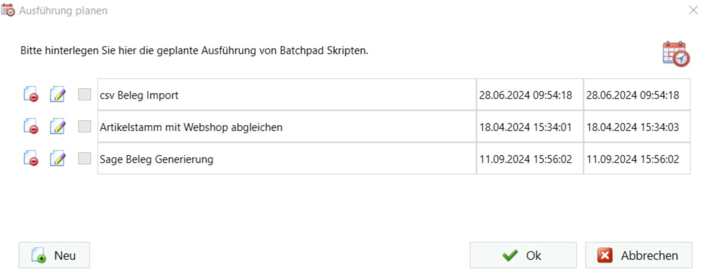
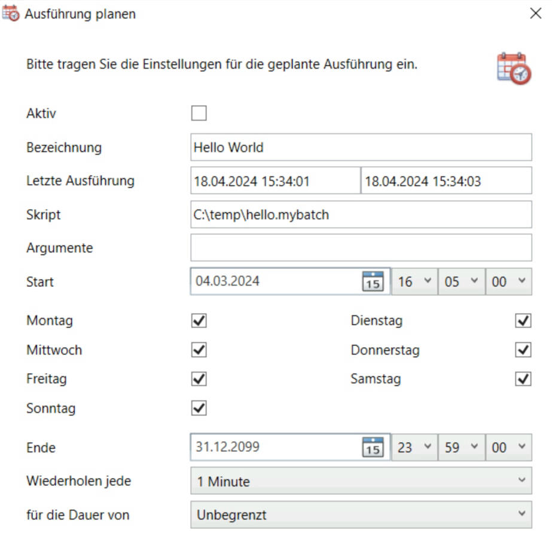

# Ausführung planen
Ausführung planen
-----------------

Über den Punkt Ausführung planen im Hauptmenü können die erstellten Skripte dann für die Ausführung über den Windows Dienst **LogiSoft Batchpad Aufgabenplanung** eingeplant werden.

Über die Einstellung Argumente können Parameter vorgegeben werden. So könnte z.B. ein vorhandener Parameter mit der Bezeichnung "MeinParameter" über das Eingabefeld Argumente mit folgendem Eintrag überschrieben werden: {@MeinParameter}="Hallo Welt!".