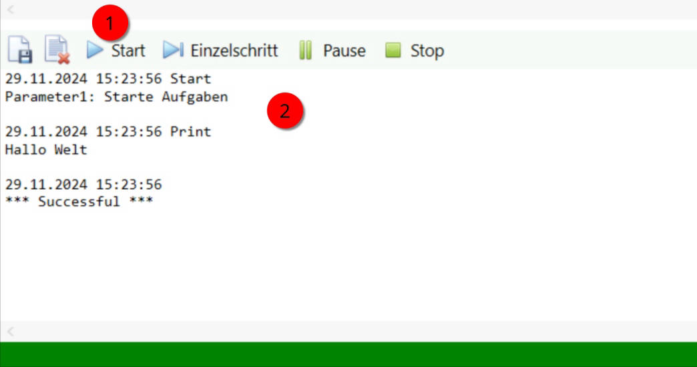
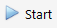
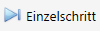
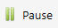
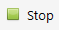

# Ausführungsmenü und Ausgabefenster
Ausführungsmenü
---------------

Über das Ausführungsmenü startet man die Ausführung des Skriptes.  Zudem kann über das Ausführungsmenü die Ausführung im Einzelschritt zum Debuggen von Skripten gestartet werden.



Der Status-Balken direkt unter dem Ausgabefenster wird zusätzlich farblich dargestellt.

Grün = Die Ausführung des Skriptes wurde erfolgreich ausgeführt

Rot = Die Ausführung des Skriptes wurde wegen eines Fehlers abgebrochen

Orange = Das Skript wird ausgeführt

Blau = Das Skript wurde gestoppt

### Protokoll speichern


Speichert den Inhalt, der in dem Ausgabefenster angezeigt wird, in einer Datei.

### Protokoll leeren

 

Leert die Anzeige im Ausgabefenster.

### Skript ausführen

 

Führt das Skript im Skripteditor aus. Die Ausführung wird im Ausgabefenster protokolliert.

Während der Ausführung wird am unteren Rand der Fortschritt durch das Fortschreiten des Balkens in Orange angezeigt.

Ist das Skript ohne Fehler beendet worden, wechselt die Anzeige auf grün. Bei einem Fehler wechselt die Anzeige auf Rot.

### Skript im Einzelschritt ausführen



Führt das Skript im Skripteditor Zeile für Zeile aus. Die aktuelle Position im Skript wird durch eine blaue Markierung angezeigt.

Die Durchführung der Einzelschritte kann über Stop abgebrochen werden.

### Skript pausieren



Pausiert die Ausführung des Skripts. Die aktuelle Position der Durchführung wird im Skript durch eine blaue Markierung angezeigt.

Hinweis: Externe Aktionen wie z.B. das Ausführen von DB-Abfragen können nicht pausiert werden.

### Skript stoppen



Beendet die Ausführung des Skripts. Am unteren Rand wird das Stoppen des Skripts durch einen blauen Balken angezeigt.

Ausgabefenster
--------------

Das Ausgabefenster gibt Informationen über die Ausführung des Skripts aus. 

Im Skript kann über die Aktion <Print ...> (Siehe Allgemein/Print) gezielt eine Ausgabe im Ausgabefenster protokolliert werden.

Die Ausgabe kann durch das Setzen von Attributen in dem Stammelement <Batch> beeinflusst werden.

Dazu stehen zwei Attribute zur Verfügung

**ActionLog (true/false)**

Wenn ActionLog mit true aktiviert ist, werden alle Aktionen bei der Ausführung protokolliert

**ConditionLog (true/false)**

Wenn ConditionLog mit true aktiviert ist, werden alle Ergebnisse von Bedingungen aus Condition Tags bei der Ausführung protokolliert

In dem folgenden Beispiel wird die Ausgabe der Aktionen und der Conditions deaktiviert:

```text-x-trilium-auto
<Batch ActionLog="false" ConditionLog="false">
    <Print Text="Hello World!" />
</Batch>
```