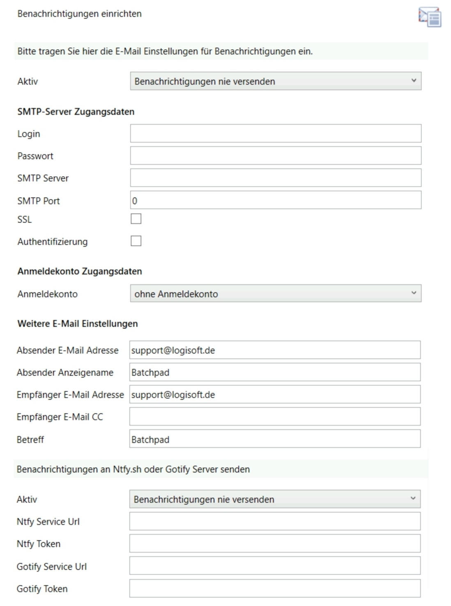

# Benachrichtigungen aktivieren
Benachrichtigungen einrichten
-----------------------------

Über die Auswahlliste **Aktiv** wird festgelegt bei welchem Ereignis eine Benachrichtigung versendet wird. Wenn "Benachrichtigungen nie versenden" ausgewählt wird, ist die Benachrichtigung deaktiviert. 

Mit den **SMTP-Server Zugangsdaten** wird eingestellt über welchen Mailserver der E-Mail-Versand stattfinden soll.

Für den Versand kann auch ein eingerichtetes **Anmeldekonto** ausgewählt werden. Hiermit ist der Versand über ein Microsoft 365 Konto und E-Mail-Adresse möglich.

Des Weiteren lassen sich auch Benachrichtigungen als Push Notifications z.B. aufs Handy schicken.  
Hierzu lässt sich z.B. ein selbst gehosteter Dienst für [ntfy.sh](https://ntfy.sh/). oder [Gotify](https://gotify.net/) anbinden.

