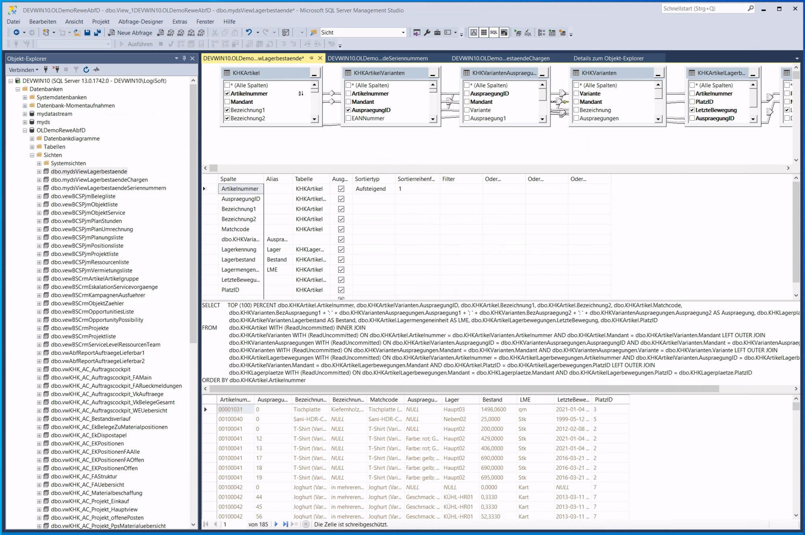
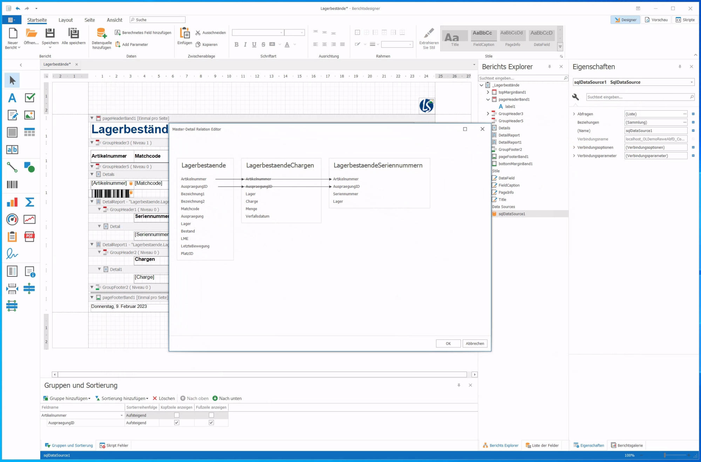
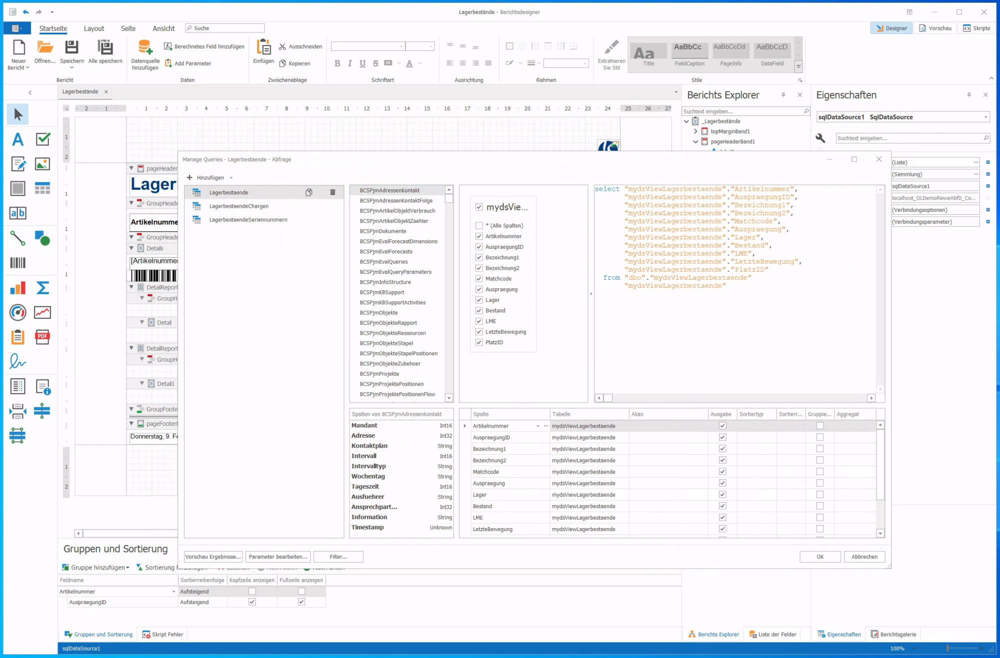
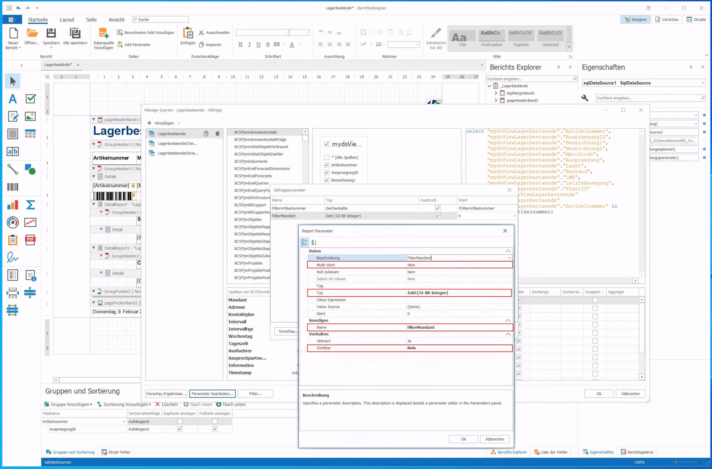
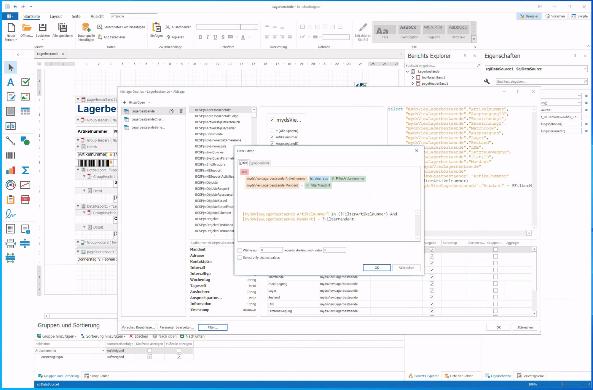
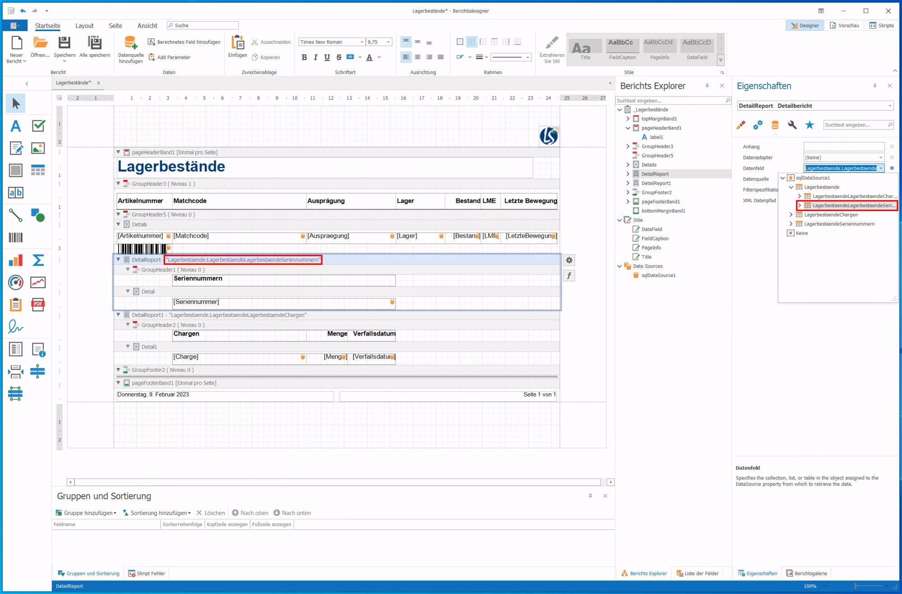
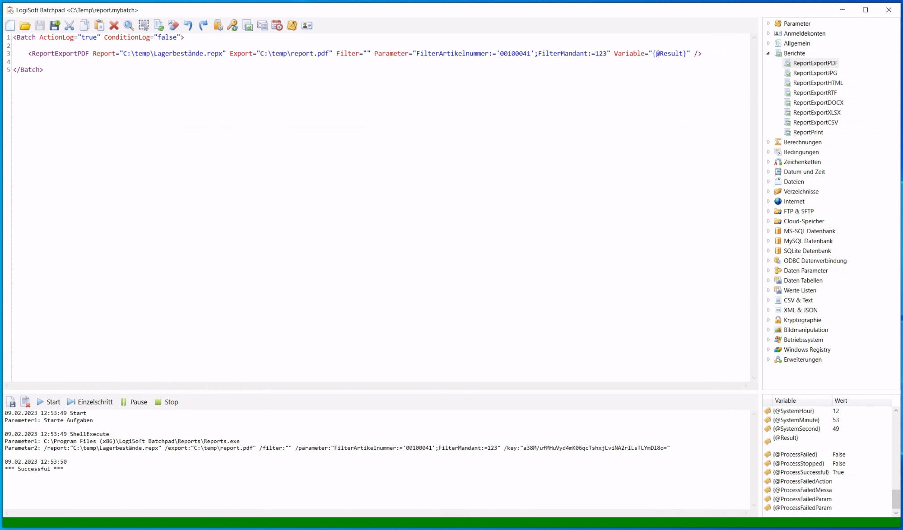
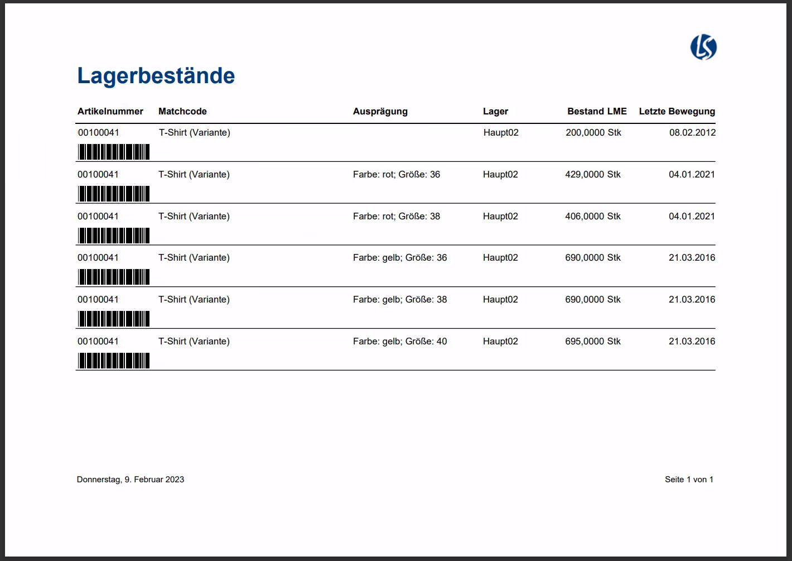

# Berichtsdesigner
Bericht über den Berichtsdesigner erstellen
-------------------------------------------

*   Im Batchpad kann man den Berichtsdesigner über das Hauptmenü starten
*   Als nächstes sollte man die Datenquelle (Verbindung zur Datenbank) einrichten.
*   Über das Kontextmenü auf **Data Sources** den Menüpunkt **Datenquelle hinzufügen** auswählen
*   Die Frage ob Benutzername und Passwort mit gespeichert werden sollen mit **Ja** bestätigen
*   Jetzt können die benötigen Views/Tabellen ausgewählt werden
*   Der Assistent kann nun mit **Fertig** geschlossen werden

Wichtig!
--------

*   Man kann von „außen“ keine SQL Syntax als WHERE Bedingung für die Datenbankabfragen setzen. Hier muss man die Werte die zur Filterung der Daten benötigt werden als **Parameter** rein reichen
*   Eine ungefilterte Tabelle im Bericht eingebunden zu haben, bedeutet immer:
    *   Das sich die Reporting-Engine **alle Daten** zu der Tabelle holt
    *   Langsames Erstellen des Berichts
    *   Unnötige Daten werden vom SQL Server abgefragt
*   Dies verlangt die Daten schon so gut wie möglich vorab über die Abfrage zu filtern
*   Für komplexere SQL Abfragen empfiehlt es sich immer eine View anzulegen. Da die Reporting-Engine so weniger Daten anfragen muss
*   Die Reporting-Engine unterstützt kein WITH READUNCOMMITTED, ein weiterer Grund eine View auf dem SQL zu verwenden, in der man dann WITH READUNCOMMITTED benutzen kann.

### Anlage einer View

Beziehungen setzen
------------------

*   Die Beziehungen zwischen den Views/Tabellen können nun festgelegt werden. 
*   Hierzu auf der **Data Source** im Kontextmenü den Punkt **Verwalten von Beziehungen...** auswählen.

Bericht Filtern
---------------

*   In den nächsten Schritten müssen die neu angelegten Parameter als Filter in die SQL Abfragen des Berichts eingebunden werden. 
*   Hierzu kann man einen Abfrage-Designer über das Kontextmenü der **Data Source** mit **Manage Queries...** öffnen.

*   Hier geht es dann über die Schaltfläche **Parameter bearbeiten...** weiter

*   Nun einen neuen Parameter hinzufügen und das Feld **Ausdruck** aktivieren
*   Unter Wert um Menü den Punkt **New Report Parameter...** wählen
*   Hier einen passenden Namen für den Parameter wählen
*   Nach der Auswahl des passenden Datentyps kann noch festlegen werden, ob mit dem Parameter ein oder mehrere Werte (**Multi-Wert**) für die Filterung übergeben werden können
*   Im Abfrage-Designer können die Parameter nun pro View/Tabelle über die Schaltfläche **Filter...** in einen Filterausdruck übernommen werden
*   Der Filterausdruck kann dann z.B. wie folgt aussehen
*   \[mydsViewLagerbestaende.Artikelnummer\] In (?FilterArtikelnummer) And \[mydsViewLagerbestaende.Mandant\] In (?FilterMandant)

*   Wenn die Parameter für die Filterung in den einzelnen Views/Tabellen Abfragen gesetzt wurden kann nun noch dem Bericht und den Detail-Berichten die zugehörige Abfrage zugeordnet werden
*   Für den Bericht wird die Hauptabfrage in der Eigenschaft **Datenfeld** des Berichts gesetzt

*   Bei den Detailberichten wird das **Datenfeld** auf dem jeweiligen DetailReport gesetzt

Bericht generieren
------------------

*   Der Bericht kann jetzt gespeichert und getestet werden
*   Dazu kann man ein Skript erstellen welches eine der Report Aktionen verwendet

Weiterführende Informationen
----------------------------

Zur Verwendung des Berichtsdesigner steht zudem die folgende Dokumentation von DevExpress zur Verfügung:

[https://docs.devexpress.com/Xt…al-studio-report-designer](https://docs.devexpress.com/XtraReports/4256/visual-studio-report-designer)