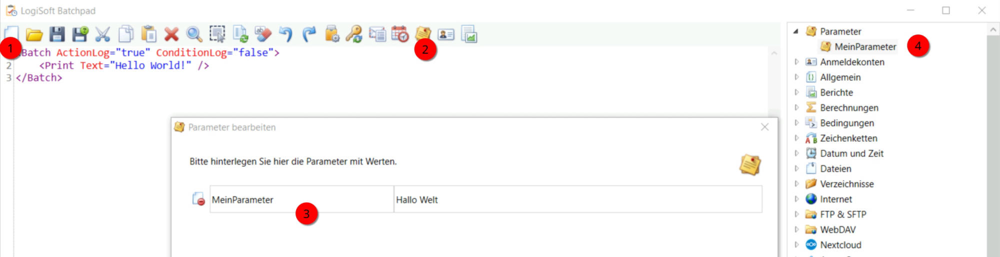
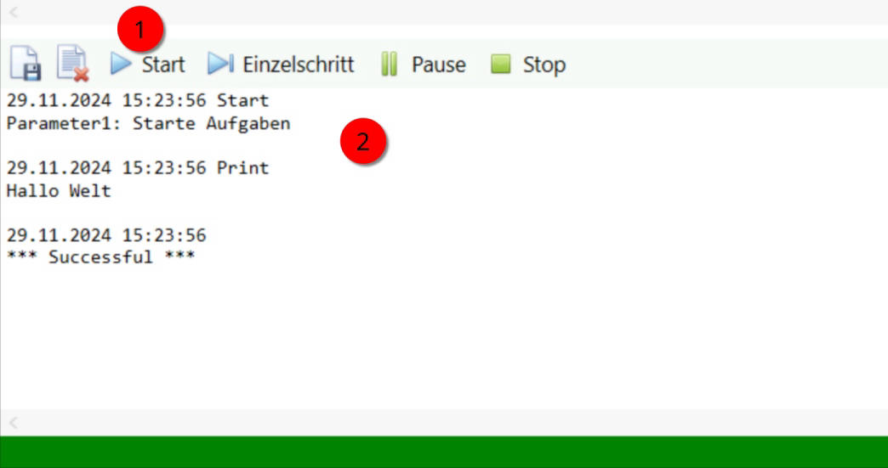

# Erste Schritte
Nachdem das Batchpad gestartet wurde klicken Sie auf die Aktion **Neu** im Hauptmenü. 

Anschließend wird ein "Hello World" Beispiel im Skripteditor geladen:

```text-x-trilium-auto
<Batch ActionLog="true" ConditionLog="false">
    <Print Text="Hello World!" />
</Batch>
```

In dem Beispiel ist die XML-typische Skriptsprache des Batchpads zu erkennen. Die Syntax des Batchpad Skripts wird auf der Seite Skripteditor beschrieben.



Öffnen Sie im Hauptmenü die **Parameter** und fügen Sie einen neuen Parameter hinzu. Nennen Sie diesen MeinParameter und weisen Sie diesem den Wert “Hallo Welt” zu. Der neu hinzugefügte Parameter erscheint anschließend rechts im Bereich “Aktionen und Parameter”.

Markieren Sie im Skripteditor mit dem Mauszeiger die Zeichenfolge "Hello World!" und führen Sie anschließend einen Doppelklick auf den von Ihnen hinzugefügten Parameter aus.

Anschließend enthält das Skript den von Ihnen hinzugefügten Parameter:

```text-x-trilium-auto
<Batch ActionLog="true" ConditionLog="false">
    <Print Text="{@MeinParameter}" Variable="{@Result}" />
</Batch>
```

Führen Sie jetzt das Skript aus, indem Sie im Ausführungsmenü auf den Button **Start** klicken. Jetzt wird das Skript ausgeführt und das Ergebnis der Ausführung im Ausgabefenster angezeigt.



Sie sind jetzt mit der Grundfunktionalität des Batchpad vertraut. Für die nächsten Schritte bietet es sich an, die möglichen Aktionen aus dem rechten Fenster per Doppelklick Ihrem Skript hinzuzufügen und das Skript nach eigenen Wünschen zu erweitern.

Eine Dokumentation zu den jeweiligen Aktionen und Parametern finden Sie auf den Seiten unter [Aktionen](https://docs.logisoft.de/share/Djb6HWIpIhVG). Alternativ können Sie einige der Beispiele studieren, welche auf den Seiten unter [Beispiele](https://docs.logisoft.de/share/4aTR1w1sx1q0) aufgeführt sind.

Für den Austausch zu Ihrem Projekt steht Ihnen die LogiSoft Community zur Verfügung: [LogiSoft Community Batchpad](https://www.logisoft-community.de/forum/index.php?board/123-projektunterst%C3%BCtzung/)

Viel Erfolg mit Ihrem ersten Batchpad Projekt!