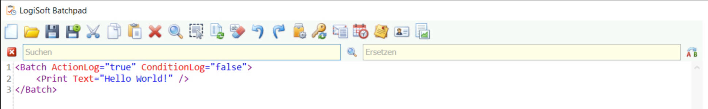

# Hauptmenü
Hauptmenü
---------

Im Hauptmenü werden zum größten Teil Operationen angeboten, welche sich auf das Skript in dem Skripteditor beziehen (z.B. Texte kopieren, einfügen, suchen usw.).

Neu
---

Öffnet ein leeres Skript in dem Skripteditor. Ein evtl. vorhandenes Skript wird dabei durch das leere Skript ersetzt (Mit vorheriger Abfrage, ob das vorhandene Skript gespeichert werden soll).

Datei öffnen
------------

Öffnet ein vorhandenes Skript in dem Skripteditor. Ein evtl. vorhandenes Skript wird dabei durch das geöffnete Skript ersetzt (Mit vorheriger Abfrage, ob das vorhandene Skript gespeichert werden soll).

Speichern
---------

 

Speichert das aktuell geladen Skript unter dem angegebenen Pfad. Wurde noch kein Pfad hinterlegt öffnet sich ein Dialog, um den Pfad für das Skript auszuwählen.

Das Speichern-Symbol wird ausgegraut dargestellt, wenn das aktuell geöffnete Skript keine Änderungen hält.

Speichern unter
---------------

 Öffnet einen Dialog, um den Pfad für das Skript auszuwählen. Anschließend wird das Skript unter dem ausgewählten Pfad abgespeichert.

Ausschneiden
------------

Markierter Text in dem Skripteditor wird aus dem Skripteditor entfernt und in den Zwischenspeicher gelegt (Tastaturkürzel: Strg + x)

Kopieren
--------

 

Markierter Text in dem Skripteditor wird in den Zwischenspeicher gelegt (Tastaturkürzel: Strg + c)

Einfügen
--------

Text aus dem Zwischenspeicher wird an die Cursor-Position im Skripteditor eingefügt (Tastaturkürzel: Strg + v).

Löschen
-------

Markierter Text in dem Skripteditor wird gelöscht.

Suchen und Ersetzen
-------------------

Suchen und Ersetzen wird im oberen Bereich direkt unter dem Hauptmenü eingeblendet.

Die Suche wird nach der Eingabe eines Suchtextes über einen Klick auf die Lupe gestartet. Gefundene Suchbegriffe werden im Skript blau markiert. Die Tags wie z.B. "</Batch>" werden in die Suche mit einbezogen.

Wird hingegen der Schaltfläche A→B angeklickt, wird der Suchtext im ersten Eingabefeld, durch den im zweiten Eingabefeld gesetzten Wert, ersetzt.

Alles auswählen
---------------

Markiert das komplette Skript im Skripteditor.

Dokument formatieren
--------------------

 

Das Skript wird anhand der XML-Struktur neu Formatiert

Dokument aufräumen
------------------

 

Entfernt nicht verwendete Attribute aus dem Skript im Skripteditor. 

Rückgängig
----------

Die letzte Eingabe im Skripteditor wird Rückgängig gemacht (Tastaturshortcut: Strg + z)

Wiederherstellen
----------------

Die letzte Eingabe im Skripteditor wiederherstellen (Tastaturshortcut: Strg + y)

Einstellungen
-------------

 

Öffnet einen Dialog mit Einstellungsmöglichkeiten und Informationen zur Batchpad Installation

Passwort ändern
---------------

Ruft einen Dialog zum Ändern des Passworts auf. 

Hinweis: Das Passwort dient zum Schutz vor dem unberechtigten Einsehen der unter Parameter hinterlegten Daten.

Benachrichtigungen einrichten
-----------------------------

Öffnet einen Dialog, über den die Einstellungen für Benachrichtigungen bearbeitet werden können.

Ausführung planen
-----------------

Öffnet den Dialog, über den die Ausführung von Batchpad Skripten geplant werden kann.

Parameter bearbeiten
--------------------

Über "Parameter bearbeiten" können vorhandene Parameter bearbeitet und erweitert werden.

Anmeldekonten verwalten
-----------------------

Öffnet einen Dialog um Anmeldekonten hinzuzufügen.

Berichtsdesigner
----------------

Ruft den Berichtsdesigner auf.