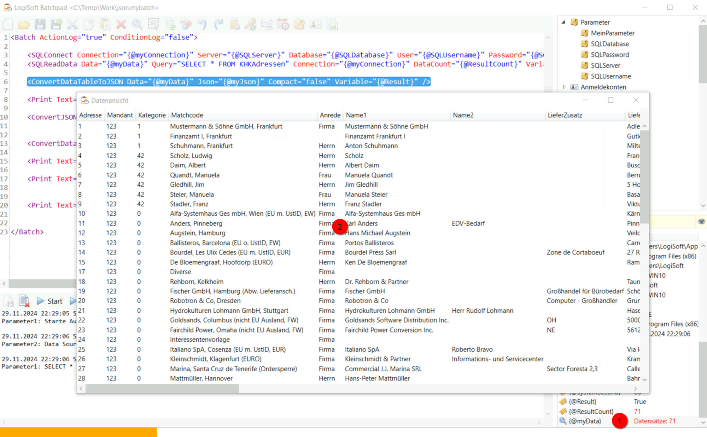

# Inspektor und Debugging
Inspektor
---------

Der Inspektor enthält während der Ausführung des Skriptes im Einzelschritt die verfügbaren Informationen zu den Variablen. Zudem können über den Inspektor, durch einen Doppelklick auf die jeweilige Variable, weitere Informationen zu der Variablen abgerufen werden. Auch lassen sich über einen Filter die Ergebnisliste der Variablen reduzieren oder nur geänderte Werte anzeigen.

Aufbau und Funktionalität
-------------------------

Der Inspektor besteht aus zwei Spalten. Die linke Spalte zeigt die in Batchpad typischer Syntax vorhandenen Variablen in der Form {@Xy}. Die rechte Spalte zeigt den zum Ausführungszeitpunkt zugewiesenen Wert an.

Hinweise: Zu Beginn ist der Inspektor leer. Erst nachdem ein Skript ausgeführt wird, füllt sich der Inspektor. Zur Ausführung ist ein großer Teil der dort angezeigten Variablen mit den standardmäßig verfügbaren Parametern aus dem Bereich "Aktionen und Parameter" belegt. Wie z.B. der Parameter {@ComputerUser} aus dem Bereich "Aktionen und Parameter" -> Betriebssystem -> ComputerUser.

Durch einen Doppelklick auf eine Reihe öffnet sich ein neues Fenster in welchem die jeweilige Variable und der zugehörige Wert angezeigt wird. Interessanter wird die Anzeige, wenn die Variable ein Objekt hält (Symbolisiert durch ein Lupenzeichen vor der Variable). 

Wenn ein Objekt in der Datenansicht geöffnet wird, werden die Daten des Objekts in einer Tabellenansicht dargestellt.

Debugging
---------

Für den Debugging-Prozess sind hauptsächlich drei Teilbereiche des Batchpad relevant:

Das Ausführungsmenü, dass über den Button "Einzelschritt durchführen" den Debugging-Prozess startet.

Der Skripteditor, der die aktuelle Position im Debugging-Prozess durch eine blaue Markierung darstellt. 

Der Inspektor der alle zum Zeitpunkt der Laufzeit zugewiesenen Variablenwerte hält. Besonders interessant sind dabei die Werte der Objekte, welche durch einen Doppelklick auf die Variable dargestellt werden können.

Zudem kann man sich direkt im Skripteditor die zur Laufzeit zugewiesene Variablenwerte anzeigen lassen. Dazu muss mit dem Mauszeiger über eine Variable gehovert werden. Nach einer kurzen Verzögerung wird der Wert in einem Tooltip angezeigt.

Für das Debuggen stehen zusätzliche Aktionen zur Verfügung. Die Aktion "Allgemein/<Pause>" kann verwendet werden, um gezielt in einen Bereich des Skripts zu gelangen, der durch Einzelschritte zu lange dauern würde.

Die Aktion "Allgemein/<ClearLog>" kann dazu verwendet werden das Protokoll des Ausgabefensters zwischenzeitlich zu leeren, um irrelevante Protokolldaten auszublenden.

Debugging für automatisierte Prozesse
-------------------------------------

Wird das Skript automatisiert ausgeführt werden, kann über die Benachrichtigungen eine E-Mail mit dem erzeugten Protokoll an eine E-Mail Adresse versendet werden.

Die Protokolle können auch als Datei auf dem Rechner gespeichert werden, den Speicherort und die Aufbewahrungsdauer kann man in den Batchpad Einstellungen festlegen.

So können auch automatisierte Prozesse auf deren Durchführung geprüft werden. 

Hinweis: In dem Protokoll wird standardmäßig die Durchführung der Aktionen und wahlweise auch der Conditions protokolliert. Zusätzliche Ausgaben können über die Aktion "Allgemein/<Print>" dem Protokoll hinzugefügt werden.