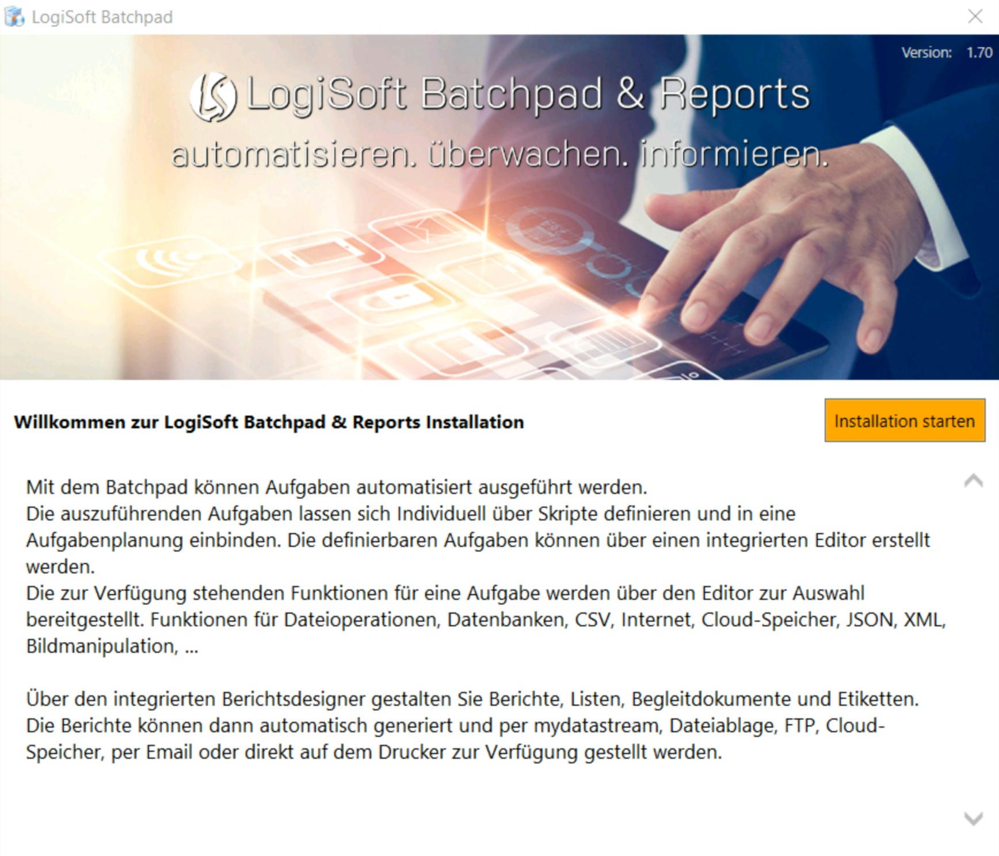
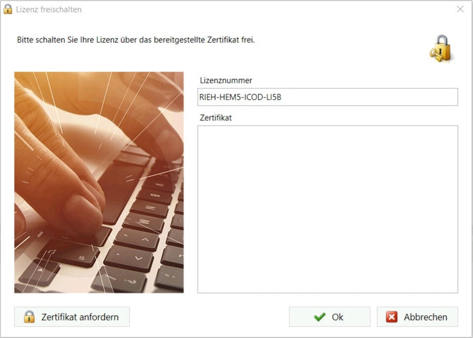
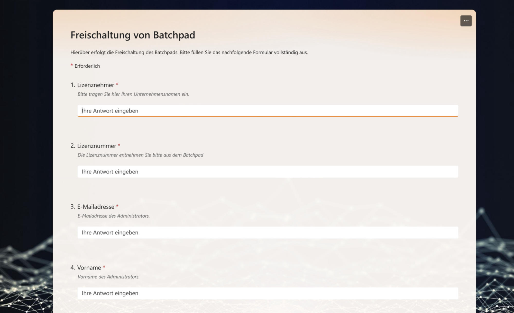

# Installation
Systemvoraussetzungen
---------------------

Das Batchpad hat keine besonderen Hardwareanforderungen und kann auf jedem Windows-Betriebssystem installiert werden, auf dem auch das .NET Framework 4.8 installiert ist. 

Installation
------------

Die ausführbare Installationsdatei (ca. 70 MB) kann aus dem Download-Bereich der LogiSoft Community bezogen werden:

[https://www.logisoft-community.de/filebase/index.php?category-file-list/101-batchpad/](https://www.logisoft-community.de/filebase/index.php?category-file-list/101-batchpad/)

Wird die Installationsdatei ausgeführt wird der Benutzer durch die Installation geführt

Die Installation wird dann automatisch abgeschlossen. Um anschließend die Lizenz freizuschalten, öffnen Sie nach dem Setup das Batchpad.

Lizenz freischalten
-------------------

Ist das Batchpad nicht lizenziert wird ein Dialog mit einer Lizenznummer und einem freien Feld für ein Zertifikat angezeigt

Über den Button "Zertifikat anfordern" werden Sie auf eine Seite weitergeleitet um sieben verschiedene Angaben zu der Installation zu machen.

Sobald die Freischaltung erfolgt ist, erhalten Sie eine E-Mail mit einem Zertifikat.

Die Freischaltung erfolgt an Werktagen im Normalfall innerhalb von 60 Minuten.