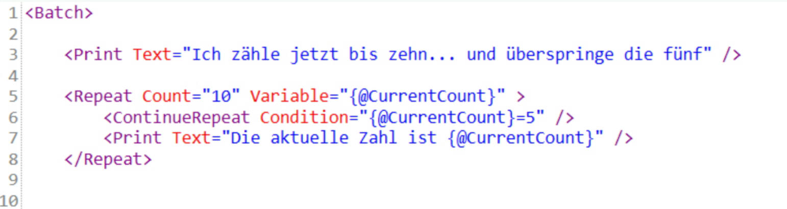
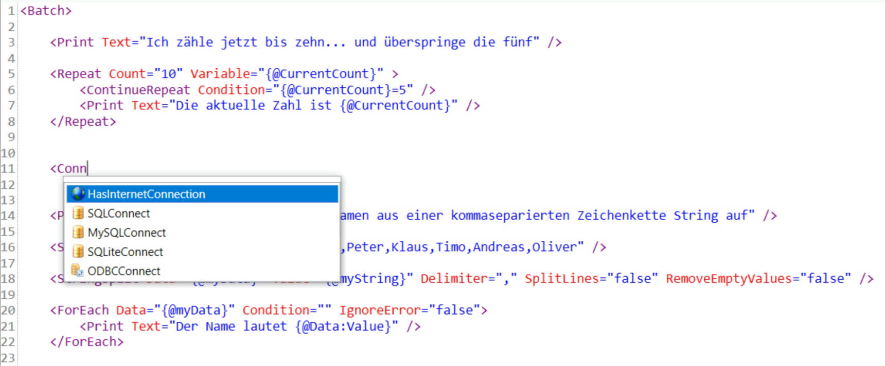
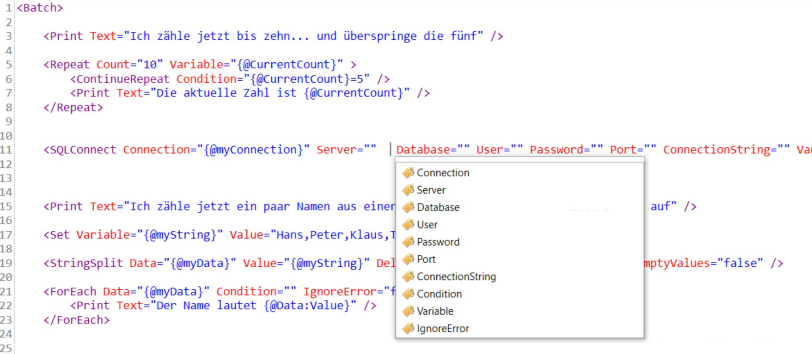
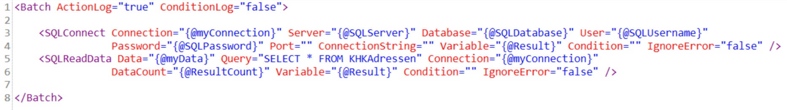
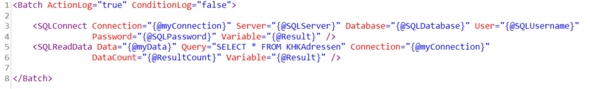

# Skripteditor
Der Skripteditor
----------------

Über den Skripteditor werden die Batchpad Skripte erstellt. 

Der Skripteditor bietet zudem eine Autovervollständigung und kann zur Laufzeit Zeile für Zeile des Skriptes durch iterieren.

Autovervollständigung
---------------------

Innerhalb des Skripts können Tags und Attribute mit Hilfe der Autovervollständigung hinzugefügt werden.

Dabei wird der Cursor im Bereich des Skripteditors platziert und durch die Eingabe von < wird ein Kontextmenü aufgerufen, welches die verfügbaren Aktionen auflistet.

Wenn noch kein <Batch> Tag vorhanden ist, wird nur das <Batch> Tag vorgeschlagen.

Innerhalb eines öffnenden Tags wird durch die Tatenkombination Strg +Leerzeichen ein Kontextmenü mit den möglichen Attributen für dieses Tag aufgerufen.

Autoformatierung
----------------

Das Skript ist XML-typisch über Tags verschachtelt. Jede Verschachtelung wird dabei mit einem Tab Unterschied zum Eltern-Tab eingerückt.

Das Batchpad unterstützt die Einhaltung dieser Formatierung durch die Funktionalität "Dokument formatieren" im Hauptmenü.

Die Formatierung des Skripts im Skripteditor wird wie folgt verändert:

*   Rückt die Tags entsprechend der Verschachtelung korrekt ein.
*   Leerzeichen und Zeilenumbrüche werden zwischen den Attributen entfernt.
*   Zeilenumbrüche vor dem öffnenden Tag <Batch> und nach dem schließenden Tag </Batch> werden entfernt.

Attribute aufräumen
-------------------

Zudem kann über das Hauptmenü die Funktionalität "Dokument aufräumen" verwendet werden, um die Anzahl an verwendeten Attributen zu verringern. Dabei werden nicht verwendete Attribute aus dem Skript entfernt. Dadurch wird die Lesbarkeit des Skriptes verbessert.

Dabei werden auch die Attribute entfernt, welche durch das Hinzufügen einer Aktion automatisch gesetzt werden, aber nicht benötigt werden.

Beispiel vorher:

Beispiel nachher:

